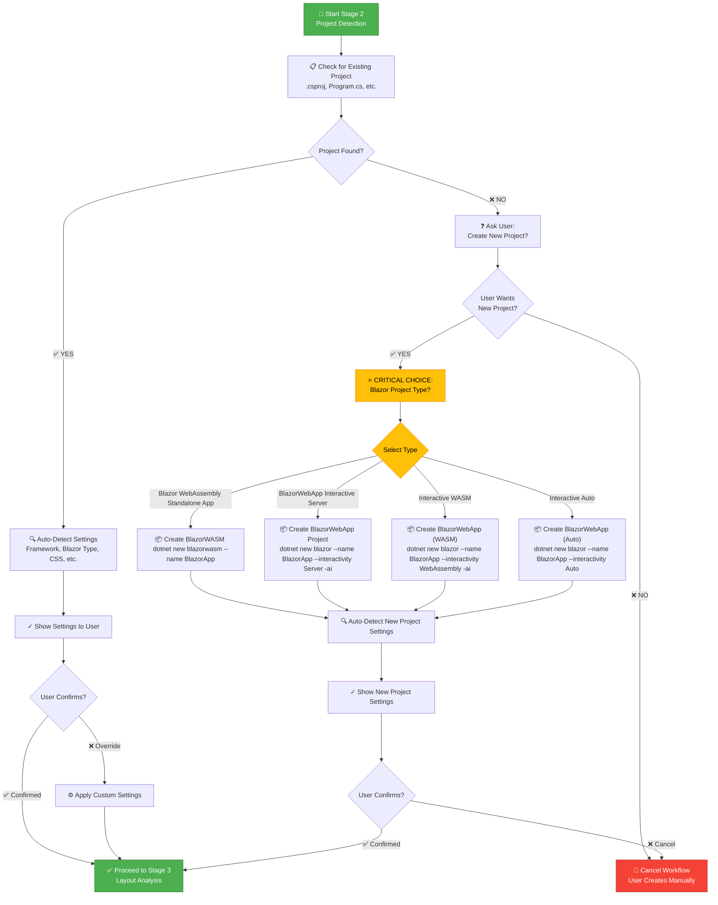

# Stage 2: Project Detection

**Purpose:** Auto-detect project structure, framework, language, and configuration to ensure generated code integrates seamlessly. If no project exists, create a new project or guide user to create a new Blazor application.

## Workflow Decision Tree



**AI Should Auto-Detect:**

1. **Framework Type & Blazor Project Type**
   - Scan for: `.csproj`, `.sln`, `appsettings.json`, `Program.cs`
   - Detect .NET version: 8.0, 9.0, 10.0, etc.
   
   **Detect Blazor Project Type (CRITICAL):**
   
   **How to Identify Blazor WebAssembly Standalone App:**
   ```
   Check .csproj for:
   <PropertyGroup>
       <TargetFramework>net10.0</TargetFramework>
   </PropertyGroup>
   
   Check for wwwroot/index.html (not App.razor in wwwroot)
   Check Program.cs for: builder.Services.AddScoped<HttpClient>()
   Project type in .csproj: Blazor WebAssembly
   Typical folder: BlazorApp or similar (Client-side app)
   ```
   
   **How to Identify BlazorWebApp - Interactive Server:**
   ```
   Check .csproj for:
   <PropertyGroup>
       <TargetFramework>net10.0</TargetFramework>
   </PropertyGroup>
   
   Check for Components/ folder with App.razor (NOT in wwwroot)
   Check Program.cs for: builder.Services.AddRazorComponents().AddInteractiveServerComponents()
   Check for: --interactivity server flag
   Project type in .csproj: Blazor Web App
   ```
   
   **How to Identify BlazorWebApp - Interactive WebAssembly:**
   ```
   Check .csproj for:
   <PropertyGroup>
       <TargetFramework>net10.0</TargetFramework>
   </PropertyGroup>
   
   Check for Components/ folder with App.razor (NOT in wwwroot)
   Check Program.cs for: builder.Services.AddRazorComponents().AddInteractiveWebAssemblyComponents()
   Check for: --interactivity wasm flag
   Project type in .csproj: Blazor Web App
   ```
   
   **How to Identify BlazorWebApp - Interactive Auto:**
   ```
   Check .csproj for:
   <PropertyGroup>
       <TargetFramework>net10.0</TargetFramework>
   </PropertyGroup>
   
   Check for Components/ folder with App.razor (NOT in wwwroot)
   Check Program.cs for: builder.Services.AddRazorComponents().AddInteractiveServerComponents().AddInteractiveWebAssemblyComponents()
   Check for: --interactivity auto flag
   Project type in .csproj: Blazor Web App
   ```
   
   **Key Difference - Theme CSS Location:**
   - **Blazor WebAssembly Standalone App:** Themes import in `wwwroot/index.html` `<head>`
   - **BlazorWebApp (All Interactive Modes):** Themes import in `Components/App.razor` `<head>`
   
   **Detection Method (Foolproof):**
   1. Check if `wwwroot/index.html` exists AND contains `<div id="app"></div>` → **Blazor WebAssembly Standalone App**
   2. Check if `Components/App.razor` exists AND contains routing/layout structure → **BlazorWebApp**
   3. Check Program.cs for interactivity mode:
      - `AddInteractiveServerComponents()` (only) → Interactive Server
      - `AddInteractiveWebAssemblyComponents()` (only) → Interactive WebAssembly
      - Both `AddInteractiveServerComponents()` AND `AddInteractiveWebAssemblyComponents()` → Interactive Auto
   4. Fallback: Check .csproj `<PropertyGroup>` for project SDK type
   5. Ask user: "Is this correct?" (if ambiguous)
   
   **How to Manually Override Project Type:**
   
   If auto-detection is wrong, user can override by setting environment variable or passing parameter:
   ```
   # Option 1: Environment Variable (Blazor Project Type)
   BLAZOR_PROJECT_TYPE=WebApp    # or WASM
   
   # Option 2: In UIBuilderContext (programmatic)
   context.project.blazorProjectType = 'WebApp'    # or 'WASM'
   
   # Option 3: User Selection Dialog
   Q: "Detected: BlazorWebApp. Is this correct?"
   A: "Yes, keep WebApp" OR "No, change to WASM"
   ```
   
   **Impact of Project Type on Generated Code:**
   
   | Aspect | Blazor WebAssembly Standalone App | BlazorWebApp (Interactive) |
   |--------|-------------------|---------------------------|
   | **Theme CSS Location** | `wwwroot/index.html` | `Components/App.razor` |
   | **Entry Point** | `wwwroot/index.html` | `Components/App.razor` |
   | **Service Registration** | `Program.cs` (builder.Services) | `Program.cs` (same) |
   | **Component Directory** | `Components/` | `Components/` |
   | **Rendering Mode** | Client-side only | Server/Auto-render/WebAssembly |
   | **Build Command** | `dotnet watch` | `dotnet run` / `dotnet watch` |
   | **API Access** | HttpClient in Services | Direct .NET backend access |
   
2. **Language Preference**
   - Check for: `.razor` files in Components/ directory
   - Check for: `.cs` code-behind files (e.g., `Component.razor.cs`)
   - Default: C# (Razor syntax) with optional code-behind separation
   
3. **CSS Strategy**
   - Check for: `tailwind.config.js` → Tailwind CSS (in wwwroot)
   - Check for: `bootstrap.bundle.css` → Bootstrap CSS
   - Check for: Existing `.css` files in `wwwroot/css/`
   - Default: Detect based on existing stylesheets or project configuration
   
4. **Component Directory**
   - Common paths: `Components/`, `Components/Pages/`, `Components/Layout/`, `Components/Shared/`
   - Find existing `.razor` component patterns
   - Detect organizational structure (flat vs nested folders)
   
5. **Formatting Rules**
   - Read `.editorconfig` for C# formatting preferences
   - Check existing `.razor` files for indentation and naming conventions
   - Apply same rules to generated Razor/C# code
   
6. **Syncfusion License & Package Versioning**
   - Check: Is `SYNCFUSION_LICENSE_KEY` in `appsettings.json` or environment variables?
   - Check: Does `Program.cs` contain `Syncfusion.Licensing.RegisterLicense()`?
   - Prompt: If missing, ask user for license key or guide setup in `Program.cs`
   
7. **Syncfusion Package Version Detection**
   - **Scan `.csproj` for existing Syncfusion NuGet packages:**
     - If `Syncfusion.Blazor.*` exists: Extract version (e.g., `32.1.19`)
     - Use SAME version for all new Syncfusion packages → Prevents version conflicts
   - **If NO existing Syncfusion packages found:**
     - Use `*` latest stable version or user-specified version for all new packages
   - **Document version decision:** Log detected version in stage output
   
## Section 1: Project Detection Flow

### Step 1.1: Check for Existing Project

**AI checks workspace for:**
1. `.csproj` file (C# project file)
2. `.sln` file (solution file)
3. `Components/` or `Pages/` directory (Blazor structure)
4. `Program.cs` (Blazor entry point)

**If project files found:**
- Proceed to **Step 1.2: Auto-Detect Settings** (normal flow)

**If NO project files found:**
- Proceed to **Step 2: Project Creation Flow** (new flow)

### Step 1.2: Auto-Detect Settings (Existing Project)

Scan for:
1. `.csproj` for: `<TargetFramework>`, `<ProjectType>`, Syncfusion package versions
2. `Program.cs` for: Blazor service registration, Syncfusion setup
3. `wwwroot/index.html` or `Components/App.razor` to determine Blazor type
4. `.editorconfig` for formatting rules
5. `tailwind.config.js` or CSS framework files
6. Syncfusion license in `appsettings.json`

---

## Section 2: Project Creation Flow (NEW)

**Triggered when: NO .csproj found in workspace**

### Step 2.1: Confirm Project Creation

**Ask user:**
```
❌ No Blazor project detected in this workspace.

Would you like to create a new Blazor application?
- Yes, create new project
- No, cancel (I'll set up manually)
```

**If user says "No":** Stop workflow, notify user to create project manually.

**If user says "Yes":** Continue to Step 2.2.

### Step 2.2: Choose Blazor Project Type ⭐ CRITICAL - MANDATORY (Never Skip)

**Always ask user (do not assume or skip):**
```
Which Blazor project type would you like to create?

[1] Blazor WebAssembly Standalone App - Standalone WebAssembly
    └─ Client-side only rendering
    └─ Themes loaded in wwwroot/index.html
    └─ Better for: SPAs, offline-first, no backend needed
    
[2] BlazorWebApp - Interactive Server
    └─ Server-side rendering with interactive components
    └─ Themes loaded in Components/App.razor
    └─ Better for: Real-time features, direct .NET backend access

[3] BlazorWebApp - Interactive WebAssembly
    └─ Client-side rendering after initial load
    └─ Themes loaded in Components/App.razor
    └─ Better for: Complex interactive UIs, better scalability

[4] BlazorWebApp - Interactive Auto
    └─ Auto-detects best rendering mode per component
    └─ Themes loaded in Components/App.razor
    └─ Better for: Best of both worlds, flexibility

Which one? [1, 2, 3, 4]
```

**Store selection:** `blazorProjectType` = `"Blazor WebAssembly Standalone App"`, `"InteractiveServer"`, `"InteractiveWebAssembly"`, or `"InteractiveAuto"`

### Step 2.3: Create New Project

**Based on user selection, run dotnet CLI command:**

**For Blazor WebAssembly Standalone App (Option 1):**
```bash
dotnet new blazorwasm --name BlazorApp
cd BlazorApp
```

**For BlazorWebApp - Interactive Server (Option 2):**
```bash
dotnet new blazor --name BlazorApp --interactivity server --all-interactive
cd BlazorApp
```

**For BlazorWebApp - Interactive WebAssembly (Option 3):**
```bash
dotnet new blazor --name BlazorApp --interactivity webassembly --all-interactive
cd BlazorApp
```

**For BlazorWebApp - Interactive Auto (Option 4):**
```bash
dotnet new blazor --name BlazorApp --interactivity auto --all-interactive
cd BlazorApp
```

**AI should:**
1. Show the command to user
2. Run command in terminal
3. Wait for completion
4. Verify `.csproj` was created
5. If failed, show error and ask user to create manually

**Project structure created:**
```
BlazorApp/
├── BlazorApp.csproj
├── Program.cs
├── App.razor (or wwwroot/index.html for WASM)
├── Components/
│   ├── Pages/
│   ├── Layout/
│   └── ...
├── appsettings.json
└── ...
```

### Step 2.4: Auto-Detect Settings from New Project

Once project is created, run normal detection (Step 1.2):
- Scan `.csproj` → .NET version, Syncfusion packages
- Scan `Program.cs` → Blazor type confirmation
- Detect CSS framework → Default is scoped .razor.css (no Tailwind yet)
- Detect component directory → `Components/`
- Set Syncfusion version → Latest stable (from new NuGet package)

### Step 2.5: Confirm Project Settings

Present detected settings to user:

```
✓ New Blazor Project Created!
  
✓ Framework: .NET 10.0
✓ Blazor Project Type: BlazorWebApp (Server/Auto-Render) ⭐
  └─ Theme CSS Location: Components/App.razor
✓ Language: C# with Razor syntax
✓ CSS: Scoped .razor.css (no framework yet)
✓ Component Dir: Components/
✓ Formatting: Default (4 spaces, camelCase properties)
✓ Syncfusion Version: 32.1.19 (latest installed)

[Confirm] [Cancel]
```

**Note:** The `blazorProjectType` now stores the interactivity mode:
- `"Blazor WebAssembly Standalone App"` - Client-side Blazor app using WebAssembly
- `"InteractiveServer"` - Server-side rendering with interactivity
- `"InteractiveWebAssembly"` - WASM-based interactivity after load
- `"InteractiveAuto"` - Automatic selection per component

**If confirmed:** Continue to Stage 3 (Layout Analysis)
**If canceled:** Offer to start over with different settings

---

## User Interaction: Full Detection Flow

### When Project EXISTS (Original Flow):

Ask user to confirm or override detected settings:
```
✓ Framework: .NET 10.0
✓ Blazor Project Type: BlazorWebApp (or BlazorWASM) ⭐ CRITICAL
  └─ Theme CSS Location: Components/App.razor (or wwwroot/index.html)
✓ Language: C# with Razor syntax
✓ CSS: Tailwind CSS (detected in wwwroot)
✓ Component Dir: Components/
✓ Formatting: EditorConfig detected - 4 spaces, camelCase properties
✓ Syncfusion Version: 32.1.19 (detected from .csproj)

[Confirm] [Override Blazor Type] [Cancel]
```

**Status:** User decides whether to accept detected settings or override them.
- If confirmed: Stage 3 (Component Mapping) will use detected settings
- If overridden: User can specify custom version or `*` for latest

### When Project DOES NOT EXIST (New Flow):

1. Ask: "Create new project?" → Yes/No
2. Ask: "Blazor WebAssembly Standalone App or Blazor WebApp?" → Select one
3. Run: `dotnet new blazor ...`
4. Confirm: Show detected settings from new project
5. Continue to Stage 3 with new project context
